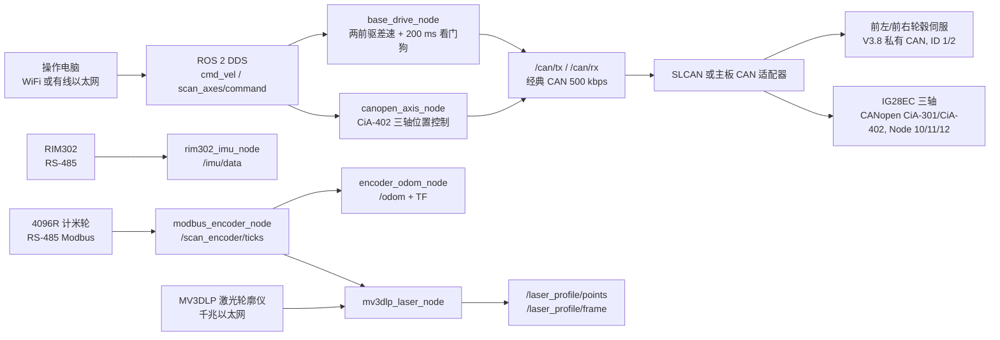

# 爬壁检测车 ROS 2 架构

开发板使用 Windows 11 原生 ROS 2。这样可以同时运行厂商的 Windows 激光轮廓仪 SDK 和 ROS 2 节点；不使用 WSL，因为 WSL 不能直接替代 Windows 版激光 SDK、Windows CAN 驱动及串口驱动。



## 已实现节点

| 节点 | 作用 | 连接 |
| --- | --- | --- |
| `base_drive_node` | 两前驱差速控制、速度限制、超时停车、轮毂伺服反馈 | `/cmd_vel`、`/can/tx`、`/can/rx`、`/drive/enable` |
| `canopen_axis_node` | IG28EC CANopen CiA-402 使能、PP 位置模式、速度/加速度/位置设置与状态轮询 | `/scan_axes/command`、`/scan_axes/enable`、`/can/tx`、`/can/rx` |
| `slcan_can_bridge_node` | SLCAN USB-CAN 适配器的 CAN 收发 | 串口与 `/can/*` |
| `rim302_imu_node` | RIM302 连续输出帧解析 | RS-485 与 `/imu/data` |
| `modbus_encoder_node` | 4096R RS-485 Modbus 计米轮读取 | RS-485 与 `/scan_encoder/ticks` |
| `encoder_odom_node` | 计米轮距离与 IMU 航向融合 | `/scan_encoder/ticks`、`/imu/data`、`/odom` |
| `mv3dlp_laser_node` | Windows 激光 SDK 采集和点云发布 | 千兆网口、`/laser_profile/points`、`/laser_profile/frame` |
| `laser_path_follower_node` | 线激光焊缝凸起提取、平滑纠偏和丢线停车 | `/laser_profile/frame`、`/cmd_vel`、`/laser_correction/status` |

## 线激光自动纠偏

新增的 `crawling_robot_control` 包先从每帧轮廓中提取焊缝中心，再通过激光安装外参和时间同步 `/odom` 将连续中心点变换到统一坐标系。节点对最近一段轨迹执行置信度加权、Huber 鲁棒局部二次曲线拟合，并从车体参考点到曲线的最近点计算有符号法向距离和真实局部切线角。控制器组合航向角、横向距离及其低通微分项，输出再经过角速度上限和 slew-rate（斜率）限制。误差越大自动降低线速度，轮廓超过 `profile_timeout_ms` 未更新则输出零速度。

主要接口：

- `ros2 service call /laser_correction/enable std_srvs/srv/SetBool "{data: true}"`：启用/停用自动纠偏；
- `ros2 service call /laser_correction/reset std_srvs/srv/Trigger "{}"`：清空滤波器和速度斜坡；
- `/laser_correction/status`（`crawling_robot_interfaces/msg/LaserCorrectionStatus`）：轮廓/几何有效性、横向误差、前视误差、航向角、曲率、拟合残差及当前控制量。

参数在 `crawling_robot_bringup/config/robot.yaml` 中配置。首次低速试车需确认 `lateral_axis`、`height_axis` 和 `steering_sign`，并将 `prominence_threshold_m` 调到焊缝凸起高度的 30--50%。

操作电脑控制程序位于仓库根目录 `robot_control_suite/desktop/robot_control_panel.py`，详见其 README。

`/laser_profile/frame` 的消息同时包含点云与计米轮的当前计数，供扫描程序按行程重建壁面模型。

## Windows 与网络

- 开发板：AD743AW 安装 Windows 11 Pro x64 和 ROS 2，主板资料确认其支持 Windows 10/11、一个 CAN 和 COM1/COM2 可切换 RS-485。
- LAN1：连接维护电脑或工业交换机。LAN2：连接激光轮廓仪或交换机。WiFi：使用 M.2 Key-E 或 USB 无线网卡接入独立 AP。
- 有线和 WiFi 的操作电脑使用同一个 `ROS_DOMAIN_ID`，并将 Windows 防火墙的 ROS 2 UDP 流量限制在专用网络。控制命令统一发布到 `/cmd_vel`，不从外部网络直接访问 CAN 话题。
- RIM302 接一个 RS-485 端口，计米轮接另一个 RS-485 端口。两者使用 115200、8N1。RIM302 的 A 接主板 A、B 接主板 B。
- 一条经典 CAN 2.0 总线同时连接两轮 V3.8 私有 CAN 伺服和三台 IG28EC CANopen 伺服。统一使用 500 kbps、标准帧、菊花链接线，且仅总线两端各 120 ohm。轮毂电机 ID 固定为 1、2；IG28EC 必须逐台配置为 Node 10、11、12，再接入同一总线。
- `slcan_can_bridge_node` 可直接驱动 SLCAN 兼容 USB-CAN；主板原生 CAN 需要其 Windows 驱动/SDK 后新增同一 `/can/tx`、`/can/rx` 话题接口的桥接实现。

## 丝杆三轴联调前置条件

IG28EC 手册已确认其支持 CANopen CiA-301/CiA-402、PP 位置模式以及对象字典 `0x6040`、`0x607A`、`0x6081`、`0x6083`、`0x6084`。`canopen_axis_node` 按这些对象进行 SDO 控制，并以 `0x6064`、`0x606C` 读取实际位置与速度。

首次接入时，每台 IG28EC 都是 Node 1，不能同时上总线。用 Step-Config 单台设置 Node 10、11、12 和 500 kbps，并断电重启确认。然后在 `config/robot.yaml` 填入每轴的丝杆导程换算值 `counts_per_meter`、行程上下限、最大速度、最大加速度、零位和正方向。默认 `dry_run: true`、`protocol_verified: false`，不会发送任何三轴实际运动命令。

V3.8 轮毂伺服的默认 CAN 波特率是 1 Mbps。首次改线时只连接两轮，临时将 CAN 适配器设为 1 Mbps，按 V3.8 的 `0xB4` 波特率设置命令改为 500 kbps，断电重启确认；再接入三台 IG28EC。不要把 1 Mbps 和 500 kbps 设备同时接到同一条 CAN 总线上。

编码器商品资料只能确认 4096 线、50 mm 计米轮、RS-485 Modbus。`modbus_encoder_node` 已实现标准 Modbus RTU 功能码 `0x03` 的 32 位计数读取；还需从卖家取得计数寄存器地址、站号和高低字顺序后填入 `counter_register`、`unit_id`、`high_word_first`。

## 构建与首台联调

## 目标板免安装发布

目标主板不需要安装 ROS 2、Python、CMake 或 colcon。开发机准备好匹配的
Windows ROS 2 运行时和 Visual Studio C++ 工具后，在仓库根目录执行：

```powershell
.\packaging\build_release.ps1 -RosRoot C:\pixi_ws\ros2-window -Clean -Zip
```

也可以双击 `packaging\build_release.cmd`，再按需传入相同参数。

脚本会先构建所有 ROS 2 节点，再把 ROS runtime、节点 overlay、MV3DLP SDK、
配置和启动脚本整理到 `target_board_release`，并生成同名 ZIP。将整个目录（或
解压后的 ZIP）复制到目标板，双击 `run_robot.cmd` 即可启动；首次需要桌面快捷方式
时双击 `create_shortcut.cmd`。停止时双击 `stop_robot.cmd`。目标板不执行
`colcon build`，也不需要修改系统 PATH。

`-IncludeSource` 可选地把 ROS 包和激光模块源码一并放进发布目录，便于现场留档；
运行时不依赖这些源码。若开发机没有 ROS runtime，打包脚本会直接报错，不会生成
缺少节点或依赖的半成品目录。

### 编译工具链

当前安装的 ROS 2 使用 `rclcpp 28`，源代码构建需要 Visual Studio 2022 的 Desktop development with C++ 工作负载、x64 MSVC v143 和 CMake 3.20 或更高版本。Visual Studio 2017 的编译器无法解析该 ROS 2 版本的模板属性，不能用于构建本工作区。部署运行时只需要与编译器匹配的 Visual C++ Redistributable x64。

在 Windows 开发板的 `D:\dev\CrawlingRobot\ros2_ws` 执行：

```powershell
cmd /c "call \"C:\Program Files\Microsoft Visual Studio\2022\Community\Common7\Tools\VsDevCmd.bat\" -arch=x64 -host_arch=x64 && set PATH=C:\pixi_ws\ros2-window\.pixi\envs\default\Library\bin;%PATH% && call C:\pixi_ws\ros2-window\local_setup.bat && colcon build --merge-install --cmake-target install"
cmd /c "call C:\pixi_ws\ros2-window\local_setup.bat && call install\setup.bat && ros2 launch crawling_robot_bringup robot.launch.py"
```

先复制并填写 `src/crawling_robot_bringup/config/robot.yaml` 中的 COM 口、激光 IP/序列号、编码器 Modbus 计数寄存器、轮径、轮距、轮毂电机到轮子的传动比和限速，以及三轴的机械行程和脉冲当量。轮子悬空时确认 CAN 反馈方向无误后，才调用：

```powershell
ros2 service call /drive/enable std_srvs/srv/SetBool "{data: true}"
```

发送端每 200 ms 内必须持续更新 `/cmd_vel`；任何网络中断、节点停止或禁用服务都会发出伺服 `0x81` 停止命令。

三轴完成机械原点、限位和急停接线验证后，才将 `canopen_axis_node.dry_run` 设为 `false`、`protocol_verified` 设为 `true`，并调用：

```powershell
ros2 service call /scan_axes/enable std_srvs/srv/SetBool "{data: true}"
```

RIM302 的原始机体坐标是 X 前、Y 右、Z 下。`rim302_imu_node` 默认将其转换为 ROS 机体坐标 X 前、Y 左、Z 上；安装时仍需测量并发布 `base_link` 到 `imu_link` 的实际静态外参。
